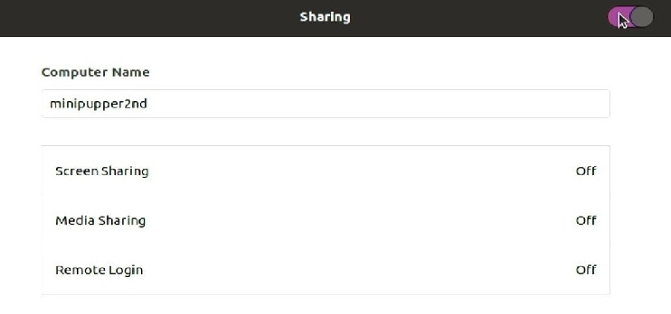
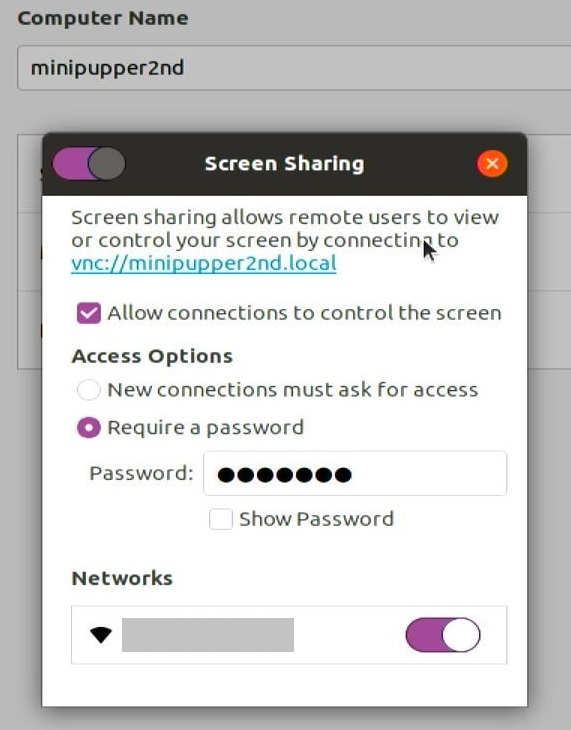

==============================
Monitor less VNC remote control (Optional)
==============================

.. contents::
  :depth: 2

1. VNC Screen Sharing 
-------------

Summary 
^^^^^^
If you use VNC Screen Sharing, It is convenient for debugging.

(This guide is described about Ubuntu 20.04.)

Step 1.1 Raspberry pi setting
^^^^^^^^^^^^^^^^^^^^^

* Boot the Raspberry pi (at first, use the HDMI Monitor.)
* Connect to your WiFi Access point.

* Then enable the VNC function.

   + Application -> Settings
   + Sharing -> Screen Sharing
   + Active the Slider.
   + set the password. (Any pass is OK.)
   + Active your AP Slider.

* (Maybe you should enable the Remote Login (SSH) too. (If you did the wrong settings, you can fix it with SSH.) )

* Open the terminal software, and type this for security setting.

::

	gsettings set org.gnome.Vino require-encryption false

  (The first letter of Vino is capitalized.)

* Then reboot your Raspberry pi and you can connect VNC with your remote client software. 
* Like these ( Remmina (for Ubuntu), VNC Viewer / UltraVNC (for Windows) )

Step 1.2 Monitor less setting
^^^^^^^^^^^^^^^^^^^^^

* Only this settings will not work, If the Raspberry Pi is started with the monitor cable disconnected, it cannot be used properly.
* So add this settings to /boot/firmware/config.txt

::

	hdmi_force_hotplug=1
	hdmi_group=2
	hdmi_mode=27

* hdmi_mode=27 is resolution(1280x800). You can change it. See this about hdmi_mode.

https://www.raspberrypi.com/documentation/computers/config_txt.html#video-options

* Then reboot and you can connect VNC without HDMI cable.
* If you failed the setting, you should use HDMI Monitor again.

